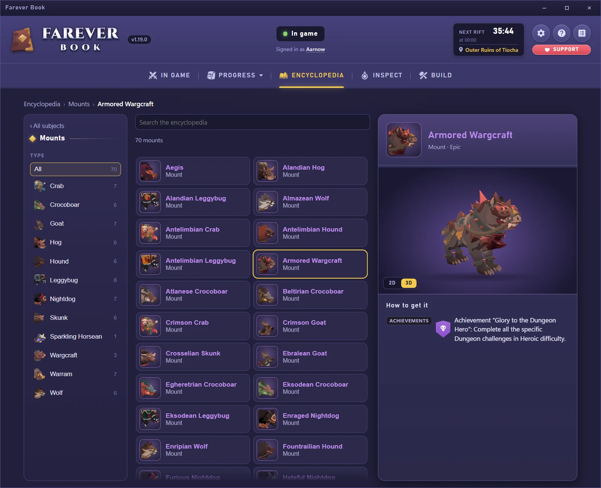
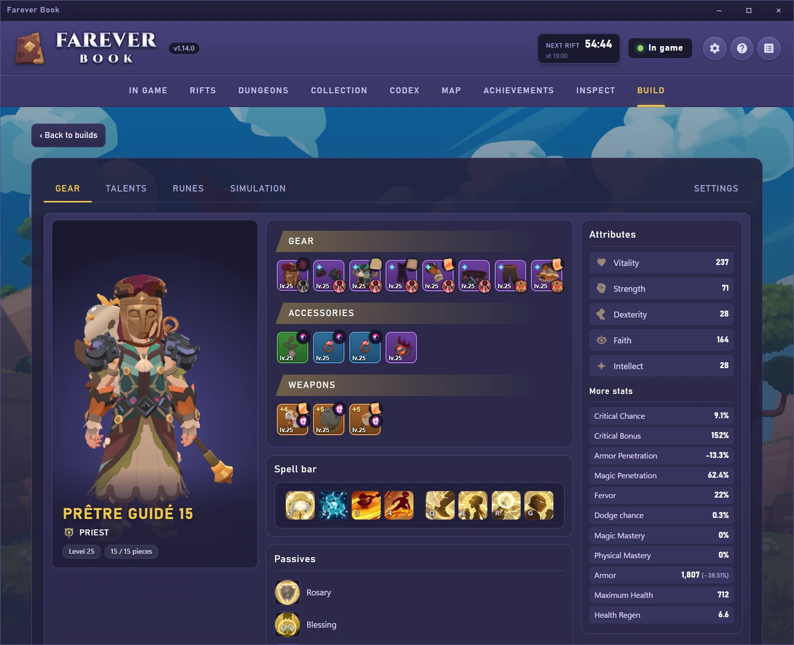
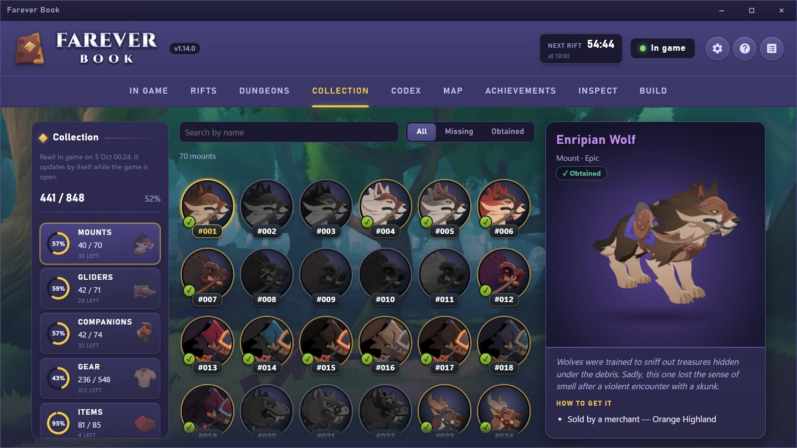
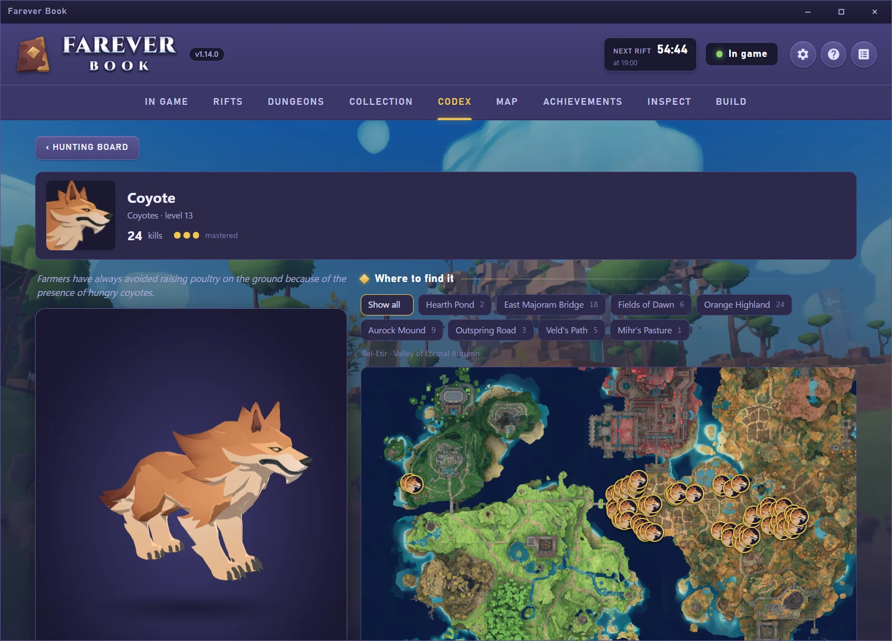
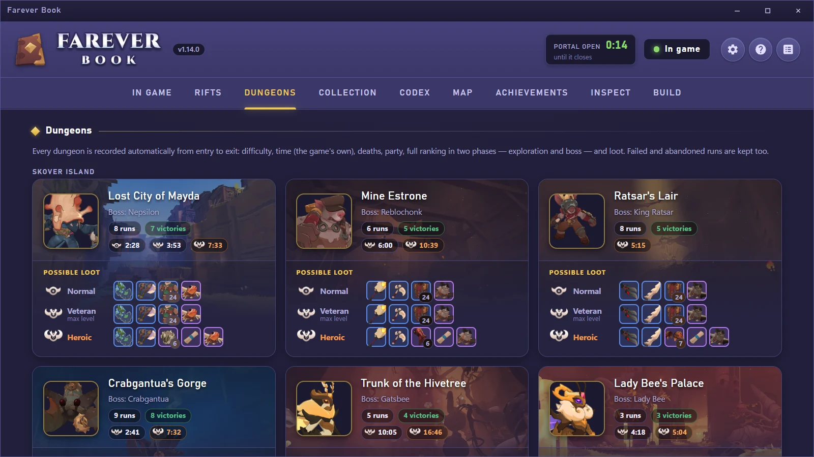
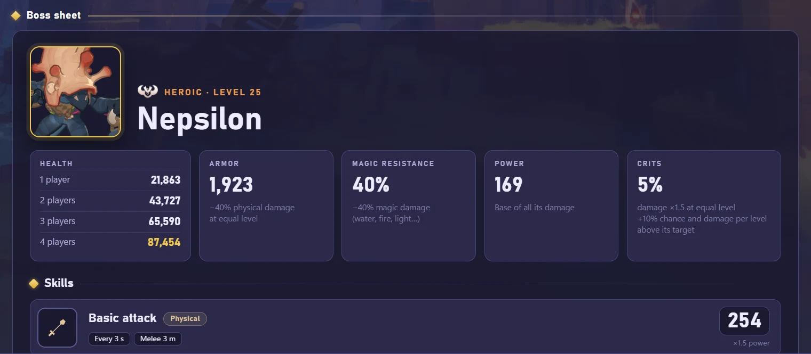

# Farever Book

**English** · [Français](README.fr.md)

**Farever Book** is an app that sits beside **Farever**, on your second
screen. It follows your sessions live (damage, healing, rifts, dungeons,
loot…) and can also be used **outside the game**, to explore a topic or put a
build together.

Available in English and French, **for Windows only** (Windows 10 or 11).

## Preview

<table>
  <tr>
    <td width="50%"></td>
    <td width="50%"></td>
  </tr>
  <tr>
    <td></td>
    <td></td>
  </tr>
  <tr>
    <td colspan="2"></td>
  </tr>
</table>

## What it offers

* **In game**: the damage and healing meter, your party, your loot chances.
* **Progress** (Collection, Codex, Map, Achievements, Dungeons, Rifts): your
  progress, what you are missing and how to get it, the loot and a report of
  every rift and every run, your records.
* **Encyclopedia**: the game's items, monsters, companions, mounts, gliders,
  NPCs and professions, with their 3D model, where to find them and how to
  get them.
* **Inspect**: the gear, talents and spells of the players around you.
* **Build**: create and compare builds (gear, talents, runes, spells and
  passives), with their stats and a damage simulation, then share them.

## Read-only

Farever Book relies entirely on the data of **your installed version of the
game**, and on your sessions when it runs alongside Farever.

It **only reads**: nothing is ever written or changed in the game, and nothing
is displayed in it. No data is collected: everything the app keeps stays on
your computer. Its code is public so anyone can check it.

## Installation

Farever Book works **on Windows only** (10 or 11). Download the
`FareverBook-<version>-Setup.exe` installer from the
[**releases of this repository**](https://github.com/aarnow/farever-book/releases),
and only from there, then run it. On first launch, the app reads your game's
data: it only takes a few moments.

## Updates

* **A new version of Farever Book**: an **Update** button appears in the app's
  header. One click is enough: it downloads and installs the new version,
  keeping your builds and your history.
* **A game update**: the app reads the game's data again by itself when it
  changes. If a module stops working, the **Repair** button in the Help tab
  fixes it in most cases.

## Fan project

Farever Book is a free, community fan project. It is **neither affiliated
with nor endorsed by Shiro Games**. Farever and its content belong to Shiro
Games.

The code is published under the [PolyForm Strict 1.0.0](LICENSE) license: it
can be read, checked and built, but not redistributed or modified to publish
another version. Ideas, bugs and questions are welcome in the **issues**. To
suggest a code change (a *pull request*), you may fork this repository and
modify your copy for that sole purpose, and you agree that your contribution
may be included in Farever Book, under its license.

## Thanks

Farever Book also exists thanks to **Brudr**, author of
[**Farever+**](https://github.com/brudrbear/FareverMeter), who generously
shared the code and allowed us to build on it. That groundwork, notably reading
HashLink bytecode and reading the game with Frida, was the starting point of
this project. Many thanks, Brudr!
